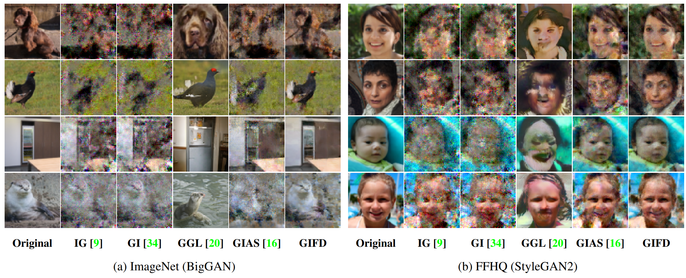

# GIFD: A Generative Gradient Inversion Method with Feature Domain Optimization
[](https://opensource.org/licenses/MIT)

A PyTorch official implementation for [GIFD: A Generative Gradient Inversion Method with Feature Domain Optimization](), accepted to ICCV-2023.


## Results


## Setup
We provide the environment configuration file exported by Anaconda, which can help you build up conveniently.
```bash
conda env create -f environment.yml
conda activate GIFD 
```  
## Dataset and model file
Download the [ImageNet](https://www.image-net.org/) and [FFHQ](https://github.com/NVlabs/ffhq-dataset) and provide their paths in the yml file.

While the model weights of BigGAN are downloaded automatically, StyleGAN2 weights require downloaded manually as follows.

`gdown --id 1c1qtz3MVTAvJpYvsMIR5MoSvdiwN2DGb` (shape predictor, placed in the root directory)

`gdown --id 1JCBiKY_yUixTa6F1eflABL88T4cii2GR` (stylegan pre-trained checkpoint, placed in the inversefed\genmodels\stylegan2_io)

## Quick start
We prepare three configuration files for performing gradient inversion attacks, including the BigGAN-based, the StyleGAN2-based, and the GAN-free methods, where we give detailed descriptions of every parameter. Feel free to contact me at fang-h23@mails.tsinghua.edu.cn if you have any concerns.
You can simply start by specifying the path of the config file.

`python rec_mult.py --config $CONFIG_PATH`

## Citation
@inproceedings{fang2023gifd,
  title={GIFD: A Generative Gradient Inversion Method with Feature Domain Optimization},
  author={Fang, Hao and Chen, Bin and Wang, Xuan and Wang, Zhi and Xia, Shu-Tao},
  booktitle={Proceedings of the IEEE/CVF International Conference on Computer Vision},
  pages={4967--4976},
  year={2023}
}

## Acknowledgement
Our code is based on [invertingGradients](https://github.com/JonasGeiping/invertinggradients) and [ILO](https://github.com/giannisdaras/ilo) and we are grateful for their great devotion.

For BigGAN, we use PyTorch official [implementation and weights](https://github.com/rosinality/stylegan2-pytorch).

For StyleGAN2, we adapt this [Pytorch implementation](https://github.com/rosinality/stylegan2-pytorch), which is based on the [official Tensorflow code](https://github.com/NVlabs/stylegan2).

We express great gratitude for their contribution to our community!
